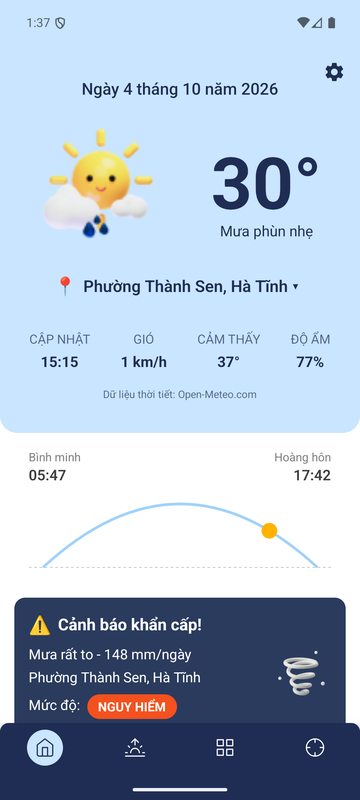
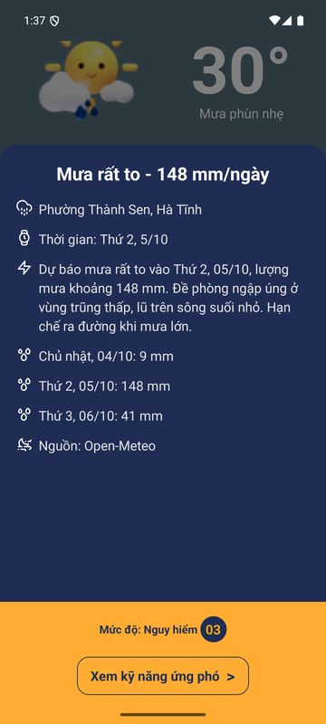
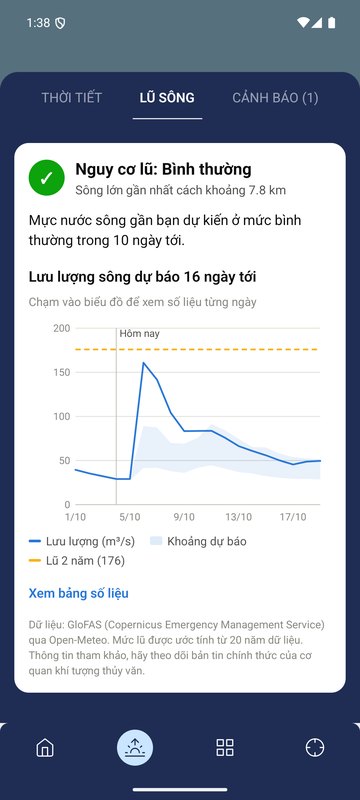
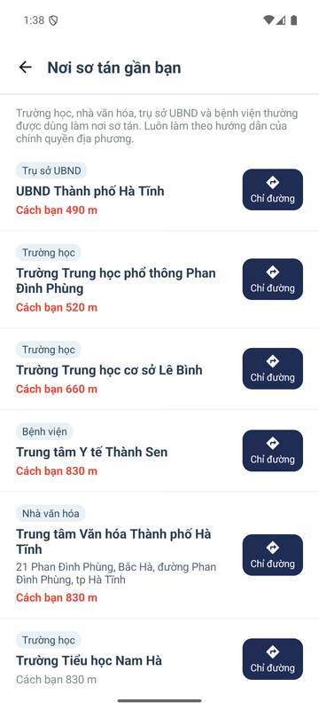
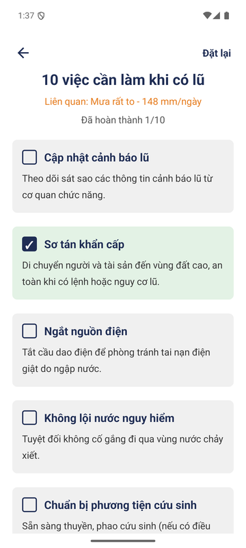
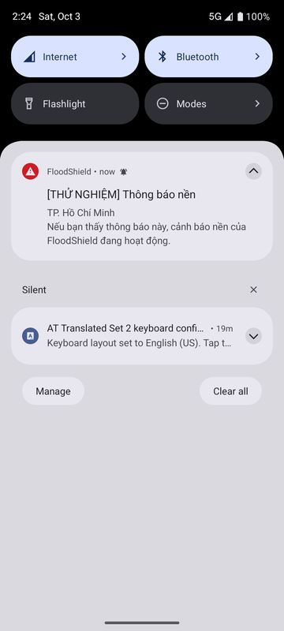
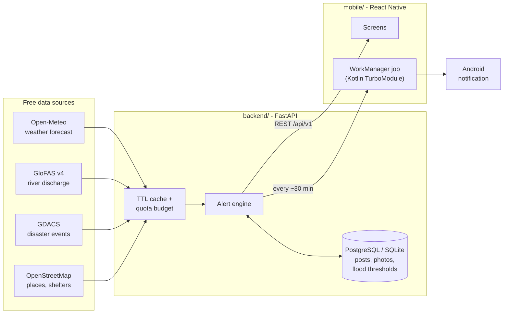

# FloodShield

[](https://github.com/pqthangv/FloodShield/actions/workflows/ci.yml)


-3ddc84?logo=android&logoColor=white)

**Real-time flood and disaster alerts for Vietnam.** An Android app and a Python API that
turn free global forecast data into local warnings in plain Vietnamese. It tells people when
heavy rain or a rising river threatens their area, shows the nearest evacuation points, and lets
neighbours share what is happening on the ground.

<table>
  <tr>
    <td align="center"><br><sub>Home: weather and a live heavy-rain alert (Hà Tĩnh)</sub></td>
    <td align="center"><br><sub>Alert details with the 3-day rainfall forecast</sub></td>
    <td align="center"><br><sub>16-day river forecast vs. the 2-year flood level</sub></td>
  </tr>
  <tr>
    <td align="center"><br><sub>Nearest evacuation places with directions</sub></td>
    <td align="center"><br><sub>What-to-do checklist linked to the alert</sub></td>
    <td align="center"><br><sub>Background notification (test alert sent from the admin API)</sub></td>
  </tr>
</table>

<sub>Screenshots from the Android 16 emulator with live data on 4 Oct 2026. The app's interface is in Vietnamese.</sub>

## Features

- **Location-based alerts:** heavy rain (50/100/200 mm per day), intense rain that floods
  streets, strong wind (Beaufort scale), heat (35/37/39 °C) and landslide risk in hilly terrain,
  using the thresholds of Vietnam's national weather service. Active typhoons, floods and
  earthquakes come from GDACS, plus warnings an administrator issues for an area.
- **River flood forecast:** finds the main river near the user and compares its 16-day
  discharge forecast (GloFAS) with 2-, 5- and 20-year flood levels derived from 20 years of history.
- **Background notifications:** an Android WorkManager job checks the user's area about every
  30 minutes, even when the app is closed, and notifies once per new or escalated alert. No
  Firebase needed.
- **Weather:** current conditions, a 48-hour and a 7-day forecast, and a live sunrise-to-sunset arc.
- **Evacuation places:** schools, ward offices (UBND), community centres and hospitals from
  OpenStreetMap, plus official shelters, sorted by distance with walking directions.
- **Emergency numbers:** 111–115 built in, so they work offline, with slide-to-call.
- **Community reports:** photo, water level and location; "I see it too" confirmations;
  report, block, automatic hiding after 3 reports, and in-app data deletion.

## How it works



## Technical highlights

- **Flood thresholds from statistics, not guesses.** For each river cell the API takes 20 years
  of daily GloFAS discharge, keeps each year's maximum, fits a Gumbel distribution (method of
  moments) and derives 2/5/20-year return levels, the same approach GloFAS uses for its own
  alerts. The main river is chosen from a 7×7 grid of ~5 km cells around the user. Thresholds
  are stored per river, so the expensive history request runs once.
  ([`backend/services/flood.py`](backend/services/flood.py))
- **Built to stay inside free API quotas.** Open-Meteo bills one call per 14 days of data and
  each grid point separately, so requests are cached by snapped coordinates. Concurrent requests
  for the same key share one upstream call, and new river analyses have a daily budget.
  OpenStreetMap queries use a bounding box instead of a radius search (about 7 s instead of
  timing out). ([`backend/services/cache.py`](backend/services/cache.py))
- **Background alerts without a push server.** A Kotlin `Worker` behind a codegen TurboModule
  (React Native new architecture) polls the API. Alert IDs are stable per date and severity, so
  users get one notification per alert and a new one only when it escalates. Alerts already
  seen in the app are skipped.
  ([`mobile/android/.../alerts/`](mobile/android/app/src/main/java/com/pqt_mobile/alerts))
- **Privacy and Google Play policy compliance by design.**
  - Photos are re-encoded server-side, which strips EXIF data including GPS.
  - Users get a random device ID instead of an account.
  - Community posts have report, block and auto-hide, and expire after 90 days.
  - Users can delete their data in the app, and the API serves the privacy policy.
  - The app needs no background-location or photo/storage permission: it uses the system Photo Picker and camera app.
- **Targets Android 16 (API 36)** as Google Play requires: the project was upgraded from React
  Native 0.79 to 0.87, with an edge-to-edge layout.

## Tech stack

| Area | Technologies |
|---|---|
| Mobile | React Native 0.87 (new architecture, Hermes), TypeScript, React Navigation 7, react-native-svg (custom charts), Kotlin + AndroidX WorkManager |
| Backend | Python 3.12+, FastAPI, SQLAlchemy 2 (async), Pydantic 2, httpx, Pillow |
| Data | Open-Meteo, GloFAS v4 (Copernicus), GDACS, OpenStreetMap (Overpass, Nominatim) |
| Quality | pytest (16 tests), Jest (4 tests), ESLint, TypeScript type checking, GitHub Actions CI |
| Deployment | Docker, PostgreSQL; free Render + Neon setup documented |

## Repository layout

```
backend/    FastAPI service: weather, flood, alerts, shelters, community posts, admin API
mobile/     React Native Android app (iOS project included, not yet tested)
scripts/    Windows helpers: install the toolchain, start everything, create the Play upload key
docs/       Setup, deployment and Google Play publishing guides, screenshots
```

## Run it locally

```bash
# API: http://localhost:8000/docs
cd backend
python -m venv .venv && .venv/bin/pip install -r requirements-dev.txt   # Windows: .venv\Scripts\...
.venv/bin/python -m uvicorn main:app --port 8000

# App (Android emulator or a USB phone)
cd mobile
npm install
npx react-native start      # terminal 1
npm run android             # terminal 2
```

Full instructions, including a one-command Windows setup: **[docs/SETUP.md](docs/SETUP.md)**.
Publishing checklist: **[docs/PUBLISHING.md](docs/PUBLISHING.md)**.

## Status

- Works end to end on an Android 16 emulator against live data. The release bundle (`.aab`) builds.
- **Not deployed yet:** the API runs locally. Deploying it and publishing to Google Play are the
  next steps ([docs/PUBLISHING.md](docs/PUBLISHING.md)).
- The iOS project was generated for React Native 0.87 but has not been built or tested.
- Forecasts are guidance only. The app tells users to follow the national weather service
  (nchmf.gov.vn) and local authorities.

## Data attribution

Weather data by [Open-Meteo.com](https://open-meteo.com) (CC BY 4.0) · River discharge: GloFAS,
Copernicus Emergency Management Service · Disaster events: [GDACS](https://www.gdacs.org) ·
Map data © [OpenStreetMap](https://www.openstreetmap.org/copyright) contributors (ODbL)
